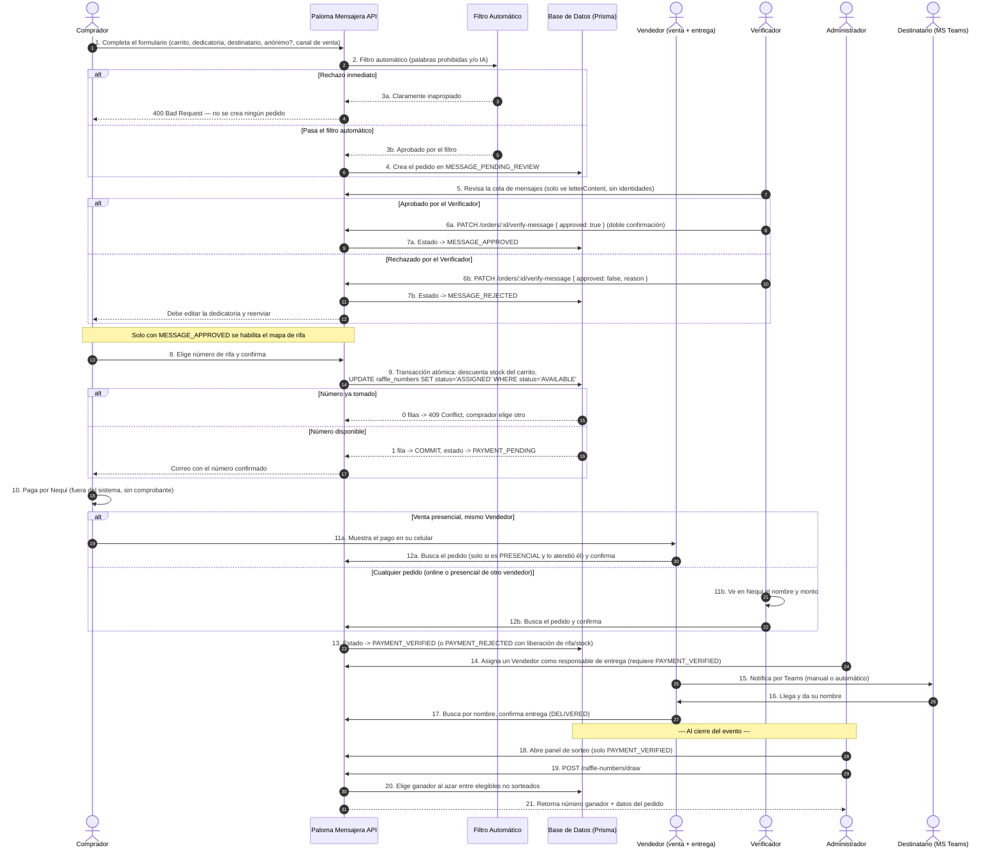
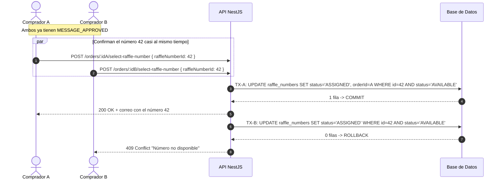
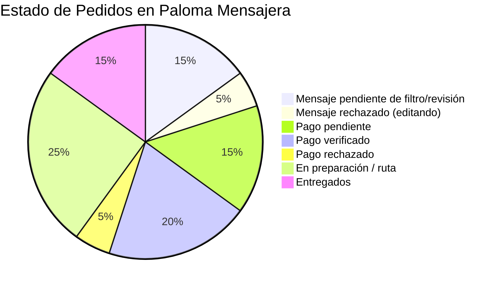

# 🕊️ Documento de Diseño de Software (SDD)
## Sistema Integral de Gestión, Ventas y Envíos - Paloma Mensajera
**Versión:** Final (consolidada)
**Fecha:** Agosto 2026
**Metodología:** Software Design Document (SDD) / IEEE 1016 & Arquitectura de Software
**Estado:** Diseño técnico completo, listo para desarrollo. Incluye: compra con carrito; **doble verificación de la dedicatoria** (filtro automático + revisión humana final); rifa atómica sin liberación por tiempo; pago exclusivo por Nequi sin comprobantes, verificado por el rol Verificador (cualquier pedido) o por el rol Vendedor (solo sus propias ventas presenciales); **fusión de los roles Vendedor y Encargado de Entrega en un solo rol**; **gestión dinámica de roles por el Administrador** para soportar la rotación de turnos del equipo; panel de sorteo con múltiples ganadores; notificación de entrega por Microsoft Teams manual/automática; acceso restringido a correo institucional.

---

## 📑 Tabla de Contenidos
1. [Información General y Propósito del Sistema](#1-información-general-y-propósito-del-sistema)
2. [Flujo de Compra, Doble Verificación de Mensaje, Pago, Sorteo y Entrega](#2-flujo-de-compra-doble-verificación-de-mensaje-pago-sorteo-y-entrega)
3. [Especificación de Formularios](#3-especificación-de-formularios)
4. [Historias de Usuario y Criterios de Aceptación (Gherkin)](#4-historias-de-usuario-y-criterios-de-aceptación-gherkin)
5. [Matriz de Roles y Permisos Nucleares](#5-matriz-de-roles-y-permisos-nucleares)
6. [Gestión Dinámica de Roles y Rotación de Turnos](#6-gestión-dinámica-de-roles-y-rotación-de-turnos)
7. [Diseño Gráfico y Arquitectura de Base de Datos (ERD Detallado)](#7-diseño-gráfico-y-arquitectura-de-base-de-datos-erd-detallado)
8. [Manejo de Concurrencia: Stock, Rifa y Rechazo de Pago](#8-manejo-de-concurrencia-stock-rifa-y-rechazo-de-pago)
9. [Seguridad, Hashing Argon2id y Rate Limiting](#9-seguridad-hashing-argon2id-y-rate-limiting)
10. [Especificación de Endpoints](#10-especificación-de-endpoints)
11. [Panel de Sorteo (Ruleta) con Múltiples Ganadores](#11-panel-de-sorteo-ruleta-con-múltiples-ganadores)
12. [Notificación de Entrega: Modo Manual y Modo Automático (Microsoft Graph API)](#12-notificación-de-entrega-modo-manual-y-modo-automático-microsoft-graph-api)
13. [Métricas y Monitoreo](#13-métricas-y-monitoreo)
14. [Variables de Entorno y Configuración](#14-variables-de-entorno-y-configuración)

---

## 1. Información General y Propósito del Sistema

### 1.1 Visión del Producto
**Paloma Mensajera** centraliza una compra 100% autoservicio: el comprador arma un **carrito**, escribe su dedicatoria, y elige destinatario y anonimato. La dedicatoria pasa por **dos verificaciones**: primero un **filtro automático** (palabras prohibidas y/o IA) que rechaza al instante contenido claramente inapropiado; si pasa, queda pendiente de la **revisión final de una persona** (el rol Verificador), quien la aprueba o rechaza. Solo tras esa aprobación humana se habilita el mapa de números de rifa. El pago —únicamente por transferencia/Nequi, sin comprobantes— lo confirma el Verificador (cualquier pedido) o el propio **Vendedor** (solo para las ventas presenciales que él mismo atendió). El rol Vendedor ahora **fusiona venta y entrega**: la misma persona que vende también avisa por Teams y confirma la entrega. El Administrador, además de tener visibilidad total, puede **reasignar y activar/desactivar el rol de cualquier persona por su correo**, dado que el equipo rota de turno.

### 1.2 Tipo de Producto
Aplicación web responsiva, sin instalación.

### 1.3 Objetivos Arquitectónicos
1. **Integridad Transaccional**: cero discrepancias en inventario y rifa ante concurrencia.
2. **Moderación de Contenido en Dos Capas**: filtro automático como primer descarte rápido, revisión humana como control final antes de la rifa.
3. **Un Solo Método de Pago, Sin Comprobantes**: solo Nequi, verificado por comparación directa (Verificador o Vendedor con alcance acotado).
4. **Roles Fusionados donde Tiene Sentido Operativo**: Vendedor y Encargado de Entrega son la misma persona/rol, reduciendo fricción en el stand.
5. **Gestión Dinámica de Roles**: el Administrador reasigna y activa/desactiva roles sin recrear cuentas, reflejando la rotación real del equipo.
6. **Bloqueo Permanente con Liberación Controlada**: el número de rifa solo se libera por rechazo explícito de pago.
7. **Confidencialidad por Diseño**: visibilidad mínima necesaria en cada vista restringida (mensajes, pagos).
8. **Sorteo Auditable** y **Acceso Institucional** restringido por dominio de correo.
9. **Seguridad Robusta**: JWT, Argon2id (RFC 9106), rate limiting, roles dinámicos, cuentas temporales (TTL).

---

## 2. Flujo de Compra, Doble Verificación de Mensaje, Pago, Sorteo y Entrega

> [!IMPORTANT]
> **Doble verificación, no una:** el filtro automático (`moderateMessageAutomatic()`) es un **primer descarte rápido** — si detecta contenido claramente ofensivo, rechaza de inmediato sin crear pedido. Si pasa, el pedido se crea pero queda **pendiente de revisión humana** (`MESSAGE_PENDING_REVIEW`); solo cuando el rol **Verificador** lo aprueba manualmente (con doble confirmación) se habilita la rifa. Esto reintroduce una cola humana, pero con el filtro automático como capa previa que reduce el volumen que un humano debe revisar.
>
> **Roles fusionados:** ya no existe un rol `delivery` separado — sus permisos (notificar por Teams, confirmar entrega) ahora los tiene el rol `seller` (Vendedor), junto con sus funciones de venta y verificación de pago presencial acotada.
>
> **Gestión dinámica de roles:** el Administrador puede cambiar el `role` de cualquier usuario y su bandera `isActive` en cualquier momento, sin crear una cuenta nueva — ver sección 6.



---

## 3. Especificación de Formularios

### 3.1 Formulario de Compra (autoservicio)
| Campo | Tipo | Obligatorio | Descripción |
| :--- | :--- | :---: | :--- |
| `buyerName` | String | Sí | Nombre del comprador/remitente. |
| `buyerEmail` | Email | Sí | Correo institucional. |
| `buyerPhone` | String | Sí | Contacto. |
| `assistedBySellerId` | UUID | No | Vendedor que orientó en stand. |
| `recipientName` | String | Sí | Nombre del destinatario. |
| `recipientTeamsUser` | String | Sí | Usuario de Teams del destinatario. |
| `cartItems` | Array | Sí | Carrito: lista de `productId` + `quantity`. |
| `letterContent` | Text | Sí | Dedicatoria — pasa por el filtro automático y luego por la cola del Verificador. |
| `isAnonymous` | Boolean | Sí | Oculta `buyerName` para el rol `seller`. |
| `salesChannel` | Enum | Sí | `ONLINE` \| `PRESENCIAL`. |

> [!NOTE]
> `raffleNumberId` se envía en un segundo paso, habilitado solo tras `MESSAGE_APPROVED` (ver 3.3). El pago no se reporta en ningún formulario: se confirma por comparación directa contra Nequi (ver 3.4).

### 3.2 Filtro Automático y Cola de Revisión Humana
```typescript
interface AutomaticFilterResult {
  passed: boolean;
  reason?: string;         // Motivo de rechazo inmediato, si aplica
  method: 'KEYWORD_FILTER' | 'AI';
}

// Vista restringida del Verificador para la cola de mensajes — GET /orders?view=message
interface OrderMessageView {
  orderId: string;
  orderCode: string;
  letterContent: string;
  // Deliberadamente EXCLUIDOS: buyerName, recipientName, recipientTeamsUser, isAnonymous, cartItems
}
```
- **`KEYWORD_FILTER`**: lista de palabras/frases prohibidas, normalizando tildes y mayúsculas. Simple y sin dependencias externas.
- **`AI`**: servicio de moderación de contenido para casos más sutiles. La elección entre ambos (o su combinación) queda a criterio técnico del equipo de desarrollo.
- Si `passed = false`, el backend responde `400` y **no crea ningún pedido**. Si `passed = true`, el pedido se crea en `MESSAGE_PENDING_REVIEW` y entra a la cola del Verificador — el filtro automático **no reemplaza** la revisión humana, la precede.

### 3.3 Verificación Humana del Mensaje (rol Verificador)
| Campo | Tipo | Obligatorio | Descripción |
| :--- | :--- | :---: | :--- |
| `orderId` | UUID | Sí | Pedido cuya dedicatoria se revisa. |
| `approved` | Boolean | Sí | `true` = aprobado (habilita la rifa), `false` = rechazado. |
| `rejectionReason` | Text | Condicional | Obligatorio si `approved = false`. |

> [!IMPORTANT]
> Requiere **doble confirmación en el cliente** antes de enviarse al backend.

### 3.4 Verificación de Pago (rol Verificador o Vendedor con alcance acotado)
| Campo | Tipo | Obligatorio | Descripción |
| :--- | :--- | :---: | :--- |
| `orderId` | UUID | Sí | Pedido a verificar. |
| `verified` | Boolean | Sí | `true`/`false`. |
| `verificationNotes` | Text | No | Observaciones. |

> [!IMPORTANT]
> Requiere doble confirmación. Si quien invoca tiene rol `seller`, el backend exige `order.salesChannel === 'PRESENCIAL'` y `order.assistedBySellerId === currentUser.id`; de lo contrario `403 Forbidden`.

```typescript
// Vista restringida de pagos — GET /orders?view=payment (Verificador: todos; Vendedor: solo sus PRESENCIAL)
interface OrderPaymentView {
  orderId: string;
  orderCode: string;
  buyerName: string;
  buyerPhone: string;
  totalAmount: number;
  paymentMethod: 'NEQUI';
  status: 'PAYMENT_PENDING' | 'PAYMENT_VERIFIED' | 'PAYMENT_REJECTED';
  // Deliberadamente EXCLUIDOS: recipientName, letterContent, isAnonymous, recipientTeamsUser, cartItems
}
```

### 3.5 Formulario de Entrega (rol Vendedor, función fusionada)
| Campo | Tipo de Dato | Obligatorio | Descripción |
| :--- | :--- | :---: | :--- |
| `orderId` | UUID | Sí | Pedido a despachar. |
| `deliveryPersonId` | UUID | Sí | Vendedor asignado como responsable de entrega. |
| `status` | Enum | Sí | `IN_ROUTE`, `DELIVERED`, `UNDELIVERED_RETRY`, `CANCELLED`. |
| `receivedBy` | String | Sí (en entrega) | Nombre de quien recibió. |
| `teamsConfirmationLog` | String | No | Registro de confirmación en Teams. |
| `notes` | Text | No | Observaciones. |

---

## 4. Historias de Usuario y Criterios de Aceptación (Gherkin)

### HU-01: Compra guiada en stand (autoservicio)
- **COMO** comprador, **QUIERO** que el vendedor me oriente pero llenar yo mismo el formulario, **PARA** que mis datos queden como yo los ingreso.
> - **DADO** que el vendedor consulta `GET /products`, **CUANDO** lo presenta al comprador, **ENTONCES** el comprador completa su propio pedido — no existe una ruta de "venta asistida" que cree el pedido en su nombre.

### HU-02: Filtro automático como primer descarte
- **COMO** organización, **QUIERO** que un filtro automático rechace de inmediato contenido claramente inapropiado, **PARA** reducir la carga de revisión humana y bloquear los casos más obvios sin demora.
> - **DADO** que el comprador envía el formulario, **CUANDO** `moderateMessageAutomatic()` determina `passed: false`, **ENTONCES** el backend responde `400` y **no crea ningún pedido**.
> - **DADO** que `passed: true`, **CUANDO** eso ocurre, **ENTONCES** el pedido se crea en `MESSAGE_PENDING_REVIEW`, a la espera del Verificador.

### HU-03: Revisión humana final del mensaje
- **COMO** Verificador, **QUIERO** revisar cada dedicatoria que ya pasó el filtro automático, **PARA** dar la aprobación definitiva antes de habilitar la rifa.
> - **DADO** un pedido en `MESSAGE_PENDING_REVIEW`, **CUANDO** el Verificador invoca `verify-message` con `approved: true` (doble confirmación), **ENTONCES** el estado pasa a `MESSAGE_APPROVED` y se habilita la rifa.
> - **DADO** el mismo caso con `approved: false`, **CUANDO** se ejecuta, **ENTONCES** el estado pasa a `MESSAGE_REJECTED`, con `rejectionReason` visible al comprador, quien debe editar y reenviar.
> - **DADO** la vista `OrderMessageView`, **CUANDO** el Verificador la consulta, **ENTONCES** nunca incluye `buyerName`, `recipientName` ni `recipientTeamsUser`.

### HU-04: Rifa asegurada tras aprobación humana, sin liberación por tiempo
- **COMO** comprador, **QUIERO** que mi número quede asegurado sin límite de tiempo, **PARA** no perder mi cupo mientras se verifica mi pago.
> - **DADO** un pedido que no está en `MESSAGE_APPROVED`, **CUANDO** intenta acceder al mapa de rifa, **ENTONCES** el backend lo rechaza (`400`).
> - **DADO** un número `AVAILABLE`, **CUANDO** dos compradores lo eligen a la vez, **ENTONCES** solo uno lo obtiene (`409` para el otro).
> - **DADO** un número `ASSIGNED`, **CUANDO** pasa el tiempo sin verificar el pago, **ENTONCES** no se libera automáticamente — solo por rechazo de pago.

### HU-05: Verificación de pago por el Verificador (cualquier pedido)
- **COMO** Verificador, **QUIERO** ver solo nombre y monto de los pendientes, y confirmar comparando contra Nequi, **PARA** no depender de comprobantes.
> - **DADO** un pedido en `PAYMENT_PENDING`, **CUANDO** confirma (`verified: true`, doble confirmación), **ENTONCES** pasa a `PAYMENT_VERIFIED`.
> - **DADO** `verified: false`, **CUANDO** se ejecuta, **ENTONCES** pasa a `PAYMENT_REJECTED`, libera la rifa y restaura el stock del carrito.

### HU-06: Confirmación de pago en el stand por el Vendedor (alcance acotado)
- **COMO** vendedor, **QUIERO** confirmar el pago de una venta presencial que yo mismo atendí, **PARA** no depender de otra persona.
> - **DADO** un pedido `PRESENCIAL` con `assistedBySellerId` igual a mí, **CUANDO** invoco `verify-payment`, **ENTONCES** el backend lo permite igual que al Verificador.
> - **DADO** un pedido `ONLINE` o atendido por otro vendedor, **CUANDO** intento verificarlo, **ENTONCES** `403 Forbidden`, aunque tenga el permiso base `orders:verify_payment`.

### HU-07: Visibilidad restringida en pedidos anónimos
- **COMO** vendedor, **QUIERO** consultar pedidos sin ver el remitente si es anónimo, **PARA** respetar la privacidad del comprador.
> - **DADO** `isAnonymous = true`, **CUANDO** el rol `seller` consulta el pedido, **ENTONCES** `buyerName` se omite de la respuesta.
> - **DADO** el mismo pedido, **CUANDO** el rol `admin` lo consulta, **ENTONCES** sí recibe `buyerName`.

### HU-08: Asignación de entrega y notificación por Teams (rol Vendedor fusionado)
- **COMO** administrador, **QUIERO** asignar a un Vendedor como responsable de entrega de un pedido pagado, **PARA** que la misma persona que vendió también entregue si aplica.
- **COMO** vendedor, **QUIERO** avisar manual o automáticamente por Teams y luego confirmar la entrega, **PARA** completar el ciclo sin necesitar un rol aparte.
> - **DADO** un pedido en `PAYMENT_VERIFIED`, **CUANDO** el admin asigna un vendedor, **ENTONCES** el estado pasa a `IN_ROUTE`.
> - El detalle del envío manual/automático está en la sección 12.

### HU-09: Sorteo con ruleta y múltiples ganadores
- **COMO** administrador, **QUIERO** un panel que muestre solo pedidos con pago verificado y permita repetir el sorteo, **PARA** hacerlo de forma visual y auditable.
> - **DADO** el panel de sorteo, **CUANDO** se cargan los elegibles, **ENTONCES** solo incluye `PAYMENT_VERIFIED` y `drawnAsWinner = false`.
> - **DADO** un número ya ganador, **CUANDO** se repite el sorteo, **ENTONCES** ese número no vuelve a aparecer.

### HU-10: Gestión dinámica de roles y rotación de turnos
- **COMO** administrador, **QUIERO** reasignar y activar/desactivar el rol de cualquier persona por su correo, **PARA** acomodar la rotación de turnos sin crear cuentas nuevas.
> - **DADO** el correo institucional de una persona ya registrada, **CUANDO** el admin invoca `PATCH /users/:id/role` con un nuevo `role`, **ENTONCES** el cambio aplica de inmediato — la próxima petición de esa persona usa los permisos del nuevo rol.
> - **DADO** una persona que termina su turno, **CUANDO** el admin invoca `PATCH /users/:id/status` con `isActive: false`, **ENTONCES** sus tokens vigentes se invalidan y no puede realizar más acciones hasta ser reactivada.
> - **DADO** un usuario desactivado, **CUANDO** el admin lo reactiva (`isActive: true`), **ENTONCES** recupera acceso con su rol vigente, sin necesidad de registrarse de nuevo.

### HU-11: Acceso restringido al correo institucional
- **COMO** organización, **QUIERO** que el login solo acepte correos del dominio institucional, **PARA** evitar accesos de gente ajena.
> - **DADO** un correo fuera del dominio configurado, **CUANDO** intenta iniciar sesión, **ENTONCES** `403 Forbidden`.

---

## 5. Matriz de Roles y Permisos Nucleares

| Permiso / Slug | Recurso | Acción | Descripción | Admin | Verificador | Vendedor | Comprador |
| :--- | :--- | :--- | :--- | :---: | :---: | :---: | :---: |
| `orders:create_public` | orders | create_public | Diligenciar el formulario de compra | ✅ | ❌ | ❌ | ✅ |
| `orders:read_all` | orders | read_all | Ver el pedido completo, sin restricciones | ✅ | ❌ | ❌ | ❌ |
| `messages:read_queue` | messages | read_queue | Ver la cola de dedicatorias pendientes (solo texto) | ✅ | ✅ | ❌ | ❌ |
| `messages:verify` | messages | verify | Aprobar/rechazar manualmente una dedicatoria | ✅ | ✅ | ❌ | ❌ |
| `orders:read_payment_info` | orders | read_payment_info | Ver solo nombre y monto para emparejar contra Nequi | ✅ | ✅ | ✅ (solo `PRESENCIAL` propios) | ❌ |
| `orders:verify_payment` | orders | verify_payment | Confirmar/rechazar un pago | ✅ | ✅ | ✅ (solo `PRESENCIAL` propios) | ❌ |
| `orders:read_public_safe` | orders | read_public_safe | Ver pedidos con `buyerName` omitido si es anónimo | ✅ | ❌ | ✅ | ❌ |
| `orders:assign_delivery` | orders | assign_delivery | Asignar un Vendedor como responsable de entrega | ✅ | ❌ | ❌ | ❌ |
| `orders:update_delivery` | orders | update_delivery | Marcar en ruta / entregado, notificar por Teams | ✅ | ❌ | ✅ | ❌ |
| `raffle:select_number` | raffle | select_number | Elegir número (solo si `MESSAGE_APPROVED`) | ✅ | ❌ | ❌ | ✅ |
| `raffle:draw_winner` | raffle | draw_winner | Girar la ruleta, ver historial | ✅ | ❌ | ❌ | ❌ |
| `products:manage` | products | manage | CRUD del catálogo, imágenes y stock | ✅ | ❌ | ❌ | ❌ |
| `products:read_active` | products | read_active | Consultar catálogo y stock | ✅ | ❌ | ✅ | ✅ |
| `users:manage_roles` | users | manage_roles | **Reasignar y activar/desactivar el rol de cualquier usuario** | ✅ | ❌ | ❌ | ❌ |
| `users:manage_temp` | users | manage_temp | Crear cuentas temporales con TTL | ✅ | ❌ | ❌ | ❌ |

> [!NOTE]
> **Roles fusionados (confirmado por el cliente):** ya no existe el rol `delivery` — sus permisos (`orders:update_delivery`, notificación por Teams) ahora están dentro del rol `seller` (Vendedor), junto con `orders:read_public_safe`, `products:read_active`, y los permisos de pago acotados.
>
> **Verificador y Administrador, separados pero con superposición intencional:** el rol `verifier` es independiente de `admin` — no se fusionan — pero `admin` conserva todos los permisos de `verifier` (y de `seller`), de modo que un Administrador siempre puede hacer el trabajo de verificación si hace falta, sin depender de que exista una persona con ese rol en un momento dado.
>
> **Doble verificación de mensajes:** `messages:read_queue` y `messages:verify` reintroducen la revisión humana, **adicional** al filtro automático (que no requiere ningún permiso porque corre como validación de backend, no como acción de un rol).
>
> **Vendedor con permisos de pago acotados:** igual que antes, el guard valida `salesChannel === 'PRESENCIAL'` y `assistedBySellerId === currentUser.id` antes de permitir `orders:verify_payment` a un `seller`.

---

## 6. Gestión Dinámica de Roles y Rotación de Turnos

### 6.1 Motivación
El equipo humano de Paloma Mensajera rota: una persona puede ser Vendedor un día y no el siguiente, o cambiar a Verificador según la necesidad del turno. El sistema debe permitir esto **sin crear una cuenta nueva cada vez**.

### 6.2 Modelo
Cada usuario tiene un único `role` vigente (`ADMIN` | `VERIFIER` | `SELLER`) y una bandera `isActive`. El Administrador puede cambiar cualquiera de los dos campos en cualquier momento.

```typescript
// Reasignar el rol de un usuario — PATCH /users/:id/role
interface ReassignRoleDto {
  newRole: 'ADMIN' | 'VERIFIER' | 'SELLER';
}

// Activar o desactivar el acceso de un usuario — PATCH /users/:id/status
interface ToggleUserStatusDto {
  isActive: boolean;
}
```

```typescript
async reassignRole(adminId: string, userId: string, dto: ReassignRoleDto) {
  const user = await this.prisma.user.update({
    where: { id: userId },
    data: { role: dto.newRole, roleAssignedByAdminId: adminId, roleAssignedAt: new Date() },
  });
  // Los tokens JWT ya emitidos incluyen el rol antiguo: se recomienda un TTL corto (ver RNF-01)
  // o una verificación de rol vigente en cada request sensible, no solo al login.
  return user;
}

async toggleUserStatus(adminId: string, userId: string, dto: ToggleUserStatusDto) {
  const user = await this.prisma.user.update({
    where: { id: userId },
    data: { isActive: dto.isActive },
  });
  if (!dto.isActive) {
    await this.sessionService.revokeAllTokensForUser(userId); // invalidación inmediata
  }
  return user;
}
```

> [!IMPORTANT]
> Como el rol puede cambiar varias veces por semana, **el JWT no debe ser la única fuente de verdad del rol** durante toda su vigencia: el backend debe validar `isActive` y, para acciones sensibles (verificar pago, aprobar mensaje, reasignar roles), volver a consultar el rol actual en base de datos en vez de confiar ciegamente en el claim del token. Alternativamente, usar tokens de vida corta (ej. 2-4 horas) con refresh, para que un cambio de rol se refleje pronto sin depender de revocación explícita.

---

## 7. Diseño Gráfico y Arquitectura de Base de Datos (ERD Detallado)

```mermaid
erDiagram
    USER ||--o{ ORDER : "verifica_pago_como (0..N)"
    USER ||--o{ DELIVERY_ASSIGNMENT : "despacha_como_vendedor (0..N)"
    USER ||--o{ MESSAGE_REVIEW : "revisa_mensaje_como (0..N)"

    PRODUCT ||--o{ ORDER_ITEM : "contiene (1:N)"
    ORDER ||--o{ ORDER_ITEM : "compone (1:N)"

    ORDER ||--|| DELIVERY_DETAIL : "detalla_entrega_teams (1:1)"
    ORDER ||--|| PAYMENT_TRANSACTION : "registra_pago (1:1)"
    ORDER ||--|| RAFFLE_NUMBER : "asigna (1:1)"
    ORDER ||--o| MESSAGE_REVIEW : "revision_humana (0:1)"
    ORDER ||--o{ DELIVERY_ASSIGNMENT : "asigna_a_vendedores (1:N)"

    USER {
        string id PK "UUID"
        string email UK "Correo institucional único"
        string name "Nombre completo"
        string password "Hash Argon2id"
        string role "ADMIN | VERIFIER | SELLER"
        boolean isActive "Permite desactivar sin eliminar la cuenta (rotación de turnos)"
        string roleAssignedByAdminId FK "Último admin que asignó/cambió el rol"
        datetime roleAssignedAt "Fecha del último cambio de rol"
        datetime expiresAt "TTL opcional para cuentas temporales"
        datetime createdAt "Timestamp"
    }

    PRODUCT {
        string id PK "UUID"
        string name UK "Nombre del producto"
        string type "COMBO | ADICIONAL"
        float price "Precio en COP"
        int stock "Inventario disponible (compartido entre canales)"
        boolean isActive "Disponible para la venta"
    }

    RAFFLE_NUMBER {
        string id PK "UUID"
        int number UK "Número visible de la rifa"
        string status "AVAILABLE | ASSIGNED"
        string orderId FK,UK "Referencia 1:1 a orders.id"
        boolean drawnAsWinner "Ya salió ganador en algún sorteo"
        string drawBatchId "Ronda/premio en que ganó (nullable)"
        datetime drawnAt "Fecha/hora del sorteo (nullable)"
    }

    ORDER {
        string id PK "UUID"
        string orderCode UK "Código de seguimiento"
        string status "MESSAGE_PENDING_REVIEW | MESSAGE_APPROVED | MESSAGE_REJECTED | PAYMENT_PENDING | PAYMENT_VERIFIED | PAYMENT_REJECTED | IN_PREPARATION | IN_ROUTE | DELIVERED | CANCELLED"
        float totalAmount "Monto total"
        string salesChannel "ONLINE | PRESENCIAL (solo informativo)"
        string assistedBySellerId FK "Vendedor que atendió (nullable)"
        datetime createdAt "Timestamp"
    }

    ORDER_ITEM {
        string id PK "UUID"
        string orderId FK
        string productId FK
        int quantity
        float unitPrice
    }

    MESSAGE_REVIEW {
        string id PK "UUID"
        string orderId FK,UK "Referencia 1:1 a orders.id"
        string automaticFilterMethod "KEYWORD_FILTER | AI — filtro que dejó pasar el mensaje"
        boolean automaticFilterPassed "Resultado del filtro automático (siempre true si el pedido existe)"
        string humanReviewStatus "PENDING | APPROVED | REJECTED"
        string reviewedByUserId FK "Verificador que dio la aprobación/rechazo final"
        datetime reviewedAt "Fecha/hora de la revisión humana"
        string rejectionReason "Motivo del rechazo, mostrado al comprador (nullable)"
    }

    DELIVERY_DETAIL {
        string id PK "UUID"
        string orderId FK,UK "Referencia 1:1 a orders.id"
        string buyerName "Visible SOLO para admin si isAnonymous=true"
        string buyerEmail "Correo institucional"
        string buyerPhone
        string recipientName
        string recipientTeamsUser
        string letterContent
        boolean isAnonymous
        boolean teamsNotificationSent
        string teamsGraphMessageId "Solo si el modo es automático"
    }

    PAYMENT_TRANSACTION {
        string id PK "UUID"
        string orderId FK,UK "Referencia 1:1 a orders.id"
        string paymentMethod "NEQUI"
        boolean verified "Resultado de la verificación"
        string verifiedByUserId FK "Verificador o Vendedor (según alcance)"
        datetime verifiedAt "Fecha/hora"
        string verificationNotes
    }

    DELIVERY_ASSIGNMENT {
        string id PK "UUID"
        string orderId FK
        string deliveryPersonId FK "Usuario con rol SELLER asignado a la entrega"
        datetime assignedAt
        datetime deliveredAt
        string receivedBy
        string teamsConfirmationLog
        string notes
    }
```



### 7.1 Notas de diseño
1. **`MESSAGE_REVIEW`** es la entidad que materializa la doble verificación: `automaticFilterPassed` siempre es `true` para cualquier pedido que llegó a existir (si el filtro automático rechaza, no se crea nada), y `humanReviewStatus` es el gate real que habilita la rifa.
2. **`raffle_numbers.status`** solo tiene `AVAILABLE`/`ASSIGNED` — se resuelve atómicamente al momento de elegir el número, después de `MESSAGE_APPROVED`.
3. **Sin campos de efectivo ni de comprobante**: el único método es `NEQUI`, verificado por comparación directa.
4. **`users.role` + `users.isActive`** reemplazan la necesidad de una tabla de roles separada — dado que solo hay tres roles fijos (`ADMIN`, `VERIFIER`, `SELLER`) y ya no hay `DELIVERY`, un enum simple en el propio usuario es suficiente y más simple que un sistema de roles dinámicos completo.

---

## 8. Manejo de Concurrencia: Stock, Rifa y Rechazo de Pago

### 8.1 Selección atómica del número de rifa


### 8.2 Implementación técnica con Prisma
```typescript
// Filtro automático — corre antes de crear el pedido
async moderateMessageAutomatic(letterContent: string): Promise<{ passed: boolean; reason?: string; method: 'KEYWORD_FILTER' | 'AI' }> {
  const normalized = normalizeText(letterContent);
  const flagged = PROHIBITED_WORDS.some((w) => normalized.includes(w));
  if (flagged) {
    return { passed: false, reason: 'El mensaje contiene lenguaje inapropiado.', method: 'KEYWORD_FILTER' };
  }
  return { passed: true, method: 'KEYWORD_FILTER' };
}

// PASO 1: Crear el pedido — solo si pasa el filtro automático; queda pendiente de revisión humana
async createOrder(dto: CreateOrderDto) {
  const filter = await this.moderateMessageAutomatic(dto.letterContent);
  if (!filter.passed) {
    throw new BadRequestException(filter.reason ?? 'El mensaje no pudo ser aprobado.');
  }

  return this.prisma.order.create({
    data: {
      status: 'MESSAGE_PENDING_REVIEW',
      salesChannel: dto.salesChannel,
      assistedBySellerId: dto.assistedBySellerId ?? null,
      deliveryDetail: {
        create: {
          buyerName: dto.buyerName,
          buyerEmail: dto.buyerEmail,
          buyerPhone: dto.buyerPhone,
          recipientName: dto.recipientName,
          recipientTeamsUser: dto.recipientTeamsUser,
          letterContent: dto.letterContent,
          isAnonymous: dto.isAnonymous,
        },
      },
      items: { create: dto.cartItems.map((i) => ({ productId: i.productId, quantity: i.quantity })) },
      messageReview: {
        create: { automaticFilterMethod: filter.method, automaticFilterPassed: true, humanReviewStatus: 'PENDING' },
      },
    },
  });
}

// PASO 2: Revisión humana final — rol `verifier`, con doble confirmación en el cliente
async verifyMessage(orderId: string, verifierId: string, approved: boolean, rejectionReason?: string) {
  const order = await this.prisma.order.findUniqueOrThrow({ where: { id: orderId } });
  if (!['MESSAGE_PENDING_REVIEW', 'MESSAGE_REJECTED'].includes(order.status)) {
    throw new BadRequestException('Este pedido no tiene un mensaje pendiente de revisión.');
  }
  return this.prisma.$transaction([
    this.prisma.order.update({ where: { id: orderId }, data: { status: approved ? 'MESSAGE_APPROVED' : 'MESSAGE_REJECTED' } }),
    this.prisma.messageReview.update({
      where: { orderId },
      data: {
        humanReviewStatus: approved ? 'APPROVED' : 'REJECTED',
        reviewedByUserId: verifierId,
        reviewedAt: new Date(),
        rejectionReason: approved ? null : rejectionReason,
      },
    }),
  ]);
}

// PASO 3: Solo si MESSAGE_APPROVED — elige número de rifa y descuenta stock del carrito
async selectRaffleNumber(orderId: string, raffleNumberId: string) {
  return this.prisma.$transaction(async (tx) => {
    const order = await tx.order.findUniqueOrThrow({ where: { id: orderId }, include: { items: true } });
    if (order.status !== 'MESSAGE_APPROVED') {
      throw new BadRequestException('Este pedido aún no tiene el mensaje aprobado por el Verificador.');
    }

    let totalAmount = 0;
    for (const item of order.items) {
      const product = await tx.product.findUnique({ where: { id: item.productId, isActive: true } });
      if (!product || product.stock < item.quantity) {
        throw new BadRequestException(`Stock insuficiente para '${product?.name ?? item.productId}'.`);
      }
      await tx.product.update({ where: { id: item.productId }, data: { stock: { decrement: item.quantity } } });
      totalAmount += product.price * item.quantity;
    }

    const raffleUpdate = await tx.raffleNumber.updateMany({
      where: { id: raffleNumberId, status: 'AVAILABLE' },
      data: { status: 'ASSIGNED', orderId },
    });
    if (raffleUpdate.count === 0) {
      throw new ConflictException('Ese número de rifa ya fue tomado. Por favor elige otro.');
    }

    await tx.order.update({ where: { id: orderId }, data: { status: 'PAYMENT_PENDING', totalAmount } });
    await tx.paymentTransaction.create({ data: { orderId, paymentMethod: 'NEQUI', verified: false } });
    await this.mailQueue.add('raffle-confirmation', { orderId });
    return order;
  });
}

// Verificación de pago — rol `verifier` (cualquier pedido) o `seller` (solo su propia venta presencial)
async verifyPayment(orderId: string, actingUser: { id: string; role: 'VERIFIER' | 'ADMIN' | 'SELLER' }, verified: boolean, notes?: string) {
  if (actingUser.role === 'SELLER') {
    const order = await this.prisma.order.findUniqueOrThrow({ where: { id: orderId } });
    if (order.salesChannel !== 'PRESENCIAL' || order.assistedBySellerId !== actingUser.id) {
      throw new ForbiddenException('Solo puedes confirmar el pago de ventas presenciales que tú mismo atendiste.');
    }
  }

  return this.prisma.$transaction(async (tx) => {
    if (verified) {
      await tx.order.update({ where: { id: orderId }, data: { status: 'PAYMENT_VERIFIED' } });
      await tx.paymentTransaction.update({
        where: { orderId },
        data: { verified: true, verifiedByUserId: actingUser.id, verifiedAt: new Date(), verificationNotes: notes },
      });
    } else {
      const orderItems = await tx.orderItem.findMany({ where: { orderId } });
      await tx.order.update({ where: { id: orderId }, data: { status: 'PAYMENT_REJECTED' } });
      await tx.raffleNumber.updateMany({ where: { orderId }, data: { status: 'AVAILABLE', orderId: null } });
      for (const item of orderItems) {
        await tx.product.update({ where: { id: item.productId }, data: { stock: { increment: item.quantity } } });
      }
      await tx.paymentTransaction.update({
        where: { orderId },
        data: { verified: false, verifiedByUserId: actingUser.id, verifiedAt: new Date(), verificationNotes: notes },
      });
    }
  });
}
```

---

## 9. Seguridad, Hashing Argon2id y Rate Limiting

1. **Argon2id**: `memoryCost: 65536`, `timeCost: 3`, `parallelism: 4` (RFC 9106).
2. **Filtrado de campos sensibles por rol** a nivel de serializer/interceptor, no en el frontend.
3. **Rol vigente re-validado en acciones sensibles**: dado que los roles rotan (sección 6), no basta con el claim del JWT — el backend re-consulta `user.role` e `isActive` antes de ejecutar `verify-message`, `verify-payment`, `assign-delivery` y `manage_roles`.
4. **Cuentas desactivadas**: `isActive = false` invalida sesiones vigentes de inmediato (`401` en la siguiente petición).
5. **Rate limiting**: 5 req/min en `/auth/login` y `/orders/public`; 100 req/min en rutas administrativas.
6. **Aleatoriedad del sorteo**: `crypto.randomInt`, nunca `Math.random()`.
7. **Variables de entorno validadas al arranque** (Joi).
8. **Dominio institucional obligatorio** en login/registro (`INSTITUTIONAL_EMAIL_DOMAIN`).

---

## 10. Especificación de Endpoints

| Método | Endpoint | Permiso | Descripción |
| :--- | :--- | :--- | :--- |
| `POST` | `/auth/login` | Público (dominio institucional) | Autenticación JWT |
| `PATCH`| `/users/:id/role` | `users:manage_roles` | Reasigna el rol de un usuario (rotación de turnos) |
| `PATCH`| `/users/:id/status` | `users:manage_roles` | Activa/desactiva el acceso de un usuario |
| `POST` | `/auth/temporary-user` | `users:manage_temp` | Crear usuario temporal con TTL |
| `GET` | `/products` | `products:read_active` | Catálogo con imágenes y stock |
| `PATCH`| `/products/:id` | `products:manage` | Actualizar producto |
| `POST` | `/orders/public` | `orders:create_public` | Crea el pedido tras pasar el filtro automático (`MESSAGE_PENDING_REVIEW`) |
| `GET` | `/orders?view=message` | `messages:read_queue` | Cola de dedicatorias pendientes para el Verificador |
| `PATCH`| `/orders/:id/verify-message` | `messages:verify` | Aprueba/rechaza la dedicatoria (doble confirmación) |
| `GET` | `/raffle-numbers` | `raffle:select_number` | Mapa de números — visible solo tras `MESSAGE_APPROVED` |
| `POST` | `/orders/:id/select-raffle-number` | `raffle:select_number` | Elige el número, descuenta stock, pasa a `PAYMENT_PENDING` |
| `GET` | `/orders?view=payment` | `orders:read_payment_info` | Vista restringida de pagos (Verificador: todos; Vendedor: sus `PRESENCIAL`) |
| `PATCH`| `/orders/:id/verify-payment` | `orders:verify_payment` | Confirma/rechaza el pago (doble confirmación; guard de alcance para `seller`) |
| `PATCH`| `/orders/:id/assign-delivery` | `orders:assign_delivery` | Asigna un Vendedor como responsable de entrega |
| `PATCH`| `/orders/:id/delivery-status` | `orders:update_delivery` | Marcar en ruta / entregado |
| `POST` | `/orders/:id/notify-teams` | `orders:update_delivery` | Envía el aviso — manual o automático (Graph API) |
| `GET` | `/raffle-numbers/eligible-for-draw` | `raffle:draw_winner` | Números con pago verificado, no sorteados |
| `POST` | `/raffle-numbers/draw` | `raffle:draw_winner` | Ejecuta una ronda de sorteo |
| `GET` | `/raffle-numbers/draw-history` | `raffle:draw_winner` | Historial de rondas |
| `PATCH`| `/settings/notification-mode` | `admin` | `MANUAL` o `AUTOMATIC` |
| `GET` | `/metrics/summary` | `admin` | Dashboard de estados y ventas por canal |

---

## 11. Panel de Sorteo (Ruleta) con Múltiples Ganadores

Sin cambios respecto al diseño previo: solo números con `PAYMENT_VERIFIED` son elegibles; cada ronda excluye ganadores anteriores (`drawnAsWinner`); el resultado se decide en el backend con `crypto.randomInt`, y el frontend solo anima la ruleta hacia el resultado ya determinado, para evitar manipulación del sorteo desde el cliente.

---

## 12. Notificación de Entrega: Modo Manual y Modo Automático (Microsoft Graph API)

Sin cambios de fondo respecto al diseño previo, salvo que quien ejecuta la notificación y confirma la entrega es ahora siempre el rol **Vendedor** (fusionado con la antigua función de Encargado). En modo automático, si Microsoft Graph API falla, el sistema degrada a modo manual para ese pedido puntual y avisa al Administrador, sin bloquear la entrega.

---

## 13. Métricas y Monitoreo



> El panel también desglosa por `salesChannel` (solo para reporte) y puede mostrar cuántos pedidos están actualmente en cola de revisión humana, útil para que el Administrador anticipe si necesita reasignar a alguien más como Verificador en un momento de alto volumen (ver sección 6).

---

## 14. Variables de Entorno y Configuración

```bash
PORT=3000
NODE_ENV=development
DATABASE_URL="file:./dev.db"
JWT_SECRET=super_secret_jwt_key_paloma_mensajera_2026_change_in_production
JWT_EXPIRES_IN=4h
THROTTLE_TTL=60000
THROTTLE_LIMIT=20
SMTP_HOST=smtp.example.com
SMTP_PORT=587
SMTP_USER=paloma.mensajera@example.com
SMTP_PASSWORD=change_in_production

# Acceso institucional
INSTITUTIONAL_EMAIL_DOMAIN=escuelaing.edu.co

# Notificación de entrega
NOTIFICATION_MODE=MANUAL

# Microsoft Graph API (modo automático) - pendiente de TI de la universidad
GRAPH_TENANT_ID=change_in_production
GRAPH_CLIENT_ID=change_in_production
GRAPH_CLIENT_SECRET=change_in_production
GRAPH_API_SCOPE=https://graph.microsoft.com/.default
```
