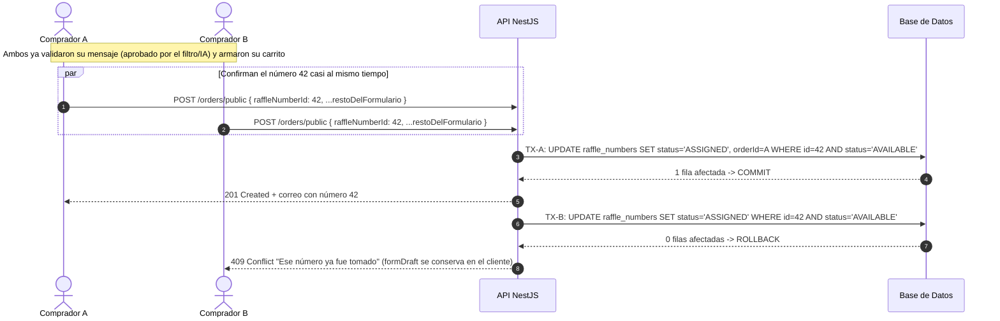
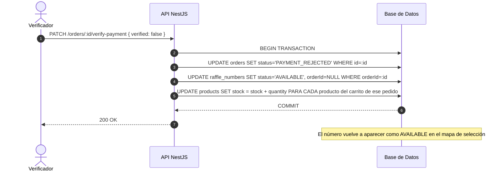
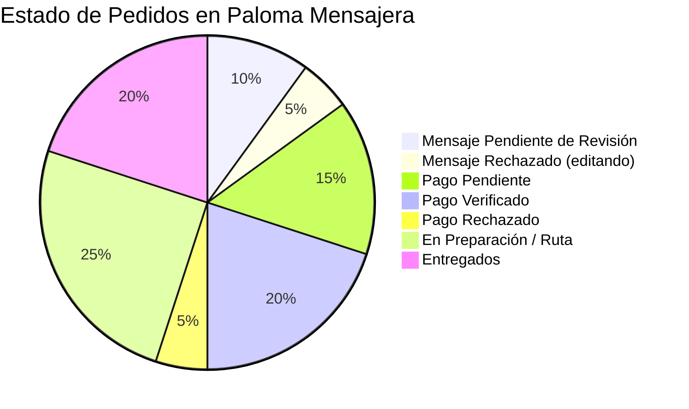

# 🕊️ Documento de Diseño de Software (SDD)
## Sistema Integral de Gestión, Ventas y Envíos - Paloma Mensajera
**Versión:** Final (consolidada)  
**Fecha:** Agosto 2026  
**Metodología:** Software Design Document (SDD) / IEEE 1016 & Arquitectura de Software  
**Estado:** Diseño técnico completo, listo para inicio de desarrollo. Todos los flujos fueron validados con el cliente: compra 100% autoservicio con carrito de productos; verificación de dedicatoria previa a la rifa; rifa con asignación atómica y sin liberación por tiempo (solo se libera al rechazar el pago); pago **exclusivamente por transferencia/Nequi, sin comprobantes** — el Verificador confirma comparando directamente contra la app de Nequi; panel de sorteo tipo ruleta con múltiples ganadores e historial; notificación de entrega por Microsoft Teams en modo manual y automatizado (Graph API); acceso restringido a correo institucional; reglas de visibilidad por anonimato aplicadas a nivel de API.

---

## 📑 Tabla de Contenidos
1. [Información General y Propósito del Sistema](#1-información-general-y-propósito-del-sistema)
2. [Flujo de Compra, Verificación de Pago, Sorteo y Entrega](#2-flujo-de-compra-verificación-de-pago-sorteo-y-entrega)
3. [Especificación de Formularios](#3-especificación-de-formularios)
4. [Historias de Usuario y Criterios de Aceptación (Gherkin)](#4-historias-de-usuario-y-criterios-de-aceptación-gherkin)
5. [Matriz de Roles y Permisos Nucleares](#5-matriz-de-roles-y-permisos-nucleares)
6. [Diseño Gráfico y Arquitectura de Base de Datos (ERD Detallado)](#6-diseño-gráfico-y-arquitectura-de-base-de-datos-erd-detallado)
7. [Manejo de Concurrencia: Stock, Rifa y Rechazo de Pago](#7-manejo-de-concurrencia-stock-rifa-y-rechazo-de-pago)
8. [Seguridad, Hashing Argon2id y Rate Limiting](#8-seguridad-hashing-argon2id-y-rate-limiting)
9. [Especificación de Endpoints](#9-especificación-de-endpoints)
10. [Panel de Sorteo (Ruleta) con Múltiples Ganadores](#10-panel-de-sorteo-ruleta-con-múltiples-ganadores)
11. [Notificación de Entrega: Modo Manual y Modo Automático (Microsoft Graph API)](#11-notificación-de-entrega-modo-manual-y-modo-automático-microsoft-graph-api)
12. [Métricas y Monitoreo](#12-métricas-y-monitoreo)
13. [Variables de Entorno y Configuración](#13-variables-de-entorno-y-configuración)

---

## 1. Información General y Propósito del Sistema

### 1.1 Visión del Producto
**Paloma Mensajera** centraliza una compra 100% autoservicio: el comprador diligencia su propio formulario (el vendedor solo orienta y muestra el catálogo con imágenes), arma un **carrito** con uno o varios productos, y escribe su dedicatoria. Al enviarla, un **filtro automático (palabras prohibidas y/o IA)** revisa el contenido al instante — **sin que ninguna persona la revise**: si es apropiada, se habilita de inmediato el mapa de números de rifa; si no, el formulario se rechaza en el momento para que el comprador lo corrija. El número elegido queda asignado de forma **atómica y definitiva** (sin expiración por tiempo). El pago —**únicamente por transferencia/Nequi**, nunca en efectivo dentro del sistema— **no requiere ningún comprobante**: el comprador simplemente paga a la cuenta indicada, y el rol **Verificador** (dedicado exclusivamente a pagos) confirma o rechaza comparando directamente el nombre y monto que ve en la app de Nequi contra la lista de pedidos pendientes en la plataforma. Si lo rechaza, el número de rifa se libera y el stock se restaura. Al cierre del evento, el administrador usa un **panel de sorteo (ruleta)** que solo incluye números con pago verificado, y puede repetirlo para varios premios. El acceso a la plataforma está restringido a correos del dominio institucional de la universidad.

### 1.2 Tipo de Producto
El sistema se entrega como una **aplicación web** (accesible desde el navegador, tanto en celular como en computador). No es una app nativa para instalar desde App Store o Play Store — esto simplifica el despliegue y evita que el comprador tenga que instalar nada para hacer su pedido.

### 1.3 Objetivos Arquitectónicos
1. **Integridad Transaccional**: cero discrepancias en inventario y números de rifa ante compras concurrentes, incluso con carritos de varios productos.
2. **Moderación de Contenido Automática**: ninguna dedicatoria llega a la rifa sin pasar un filtro automático (palabras prohibidas y/o IA) — protege a la organización de mensajes ofensivos enviados en su nombre, sin depender de que una persona esté disponible para revisarlos.
3. **Un Solo Método de Pago, Sin Efectivo en el Sistema**: solo transferencia/Nequi pasa por la plataforma; el efectivo se maneja completamente aparte, fuera del sistema.
4. **Bloqueo Permanente con Liberación Controlada**: un número de rifa asignado solo se libera por un evento de negocio explícito (rechazo de pago), nunca por vencimiento de un temporizador.
5. **Confidencialidad por Diseño**: pedidos anónimos ocultan el remitente para roles Vendedor y Encargado a nivel de API; el rol Verificador nunca ve el destinatario ni el estado de anonimato, en ninguna de sus dos vistas restringidas.
6. **Prevención de Errores Humanos**: doble confirmación obligatoria antes de confirmar o rechazar un pago (la única acción de verificación que sigue a cargo de una persona).
7. **Sorteo Auditable**: aleatoriedad uniforme y verificable, restringida a números con pago verificado, sin repetir ganadores entre sorteos del mismo evento.
8. **Acceso Institucional**: solo correos del dominio de la universidad pueden usar la plataforma.
9. **Seguridad Robusta**: JWT, Argon2id (RFC 9106), rate limiting, roles dinámicos, cuentas temporales (TTL).

---

## 2. Flujo de Compra, Moderación Automática de Mensaje, Pago, Sorteo y Entrega

> [!IMPORTANT]
> **Moderación automática, sin cola humana:** la dedicatoria se revisa **al instante**, mediante un filtro de palabras y/o un servicio de IA — **ninguna persona la revisa**. Si el contenido es apropiado, el comprador continúa de inmediato hacia la selección de rifa; si no, el formulario se rechaza en el momento (sin crear ningún pedido) y se le pide corregir el mensaje.
>
> **Sin expiración por tiempo:** el número de rifa queda **asignado de forma permanente** en el mismo instante en que se crea el pedido. La única forma de liberarlo es que el Verificador **rechace** el pago de ese pedido.
>
> **El rol Verificador ahora tiene una sola función: los pagos.** El único método de pago gestionado por el sistema es **transferencia/Nequi**. **No existe carga ni envío de comprobante**: el Verificador confirma el pago consultando directamente la app de Nequi (ve el nombre de quien pagó y el monto) y buscando ese mismo nombre en la lista de pedidos con pago pendiente dentro de la plataforma. **El pago en efectivo no pasa por el sistema en ningún punto** — se maneja aparte, en una caja física de la organización, sin ningún registro en la plataforma. La confirmación de pago requiere una **segunda confirmación** en el cliente antes de aplicarse (patrón "¿Estás seguro?"), para evitar toques accidentales.

```mermaid
sequenceDiagram
    autonumber
    actor Comprador as Comprador
    participant API as Paloma Mensajera API
    participant Mod as Módulo de Moderación (filtro/IA)
    participant DB as Base de Datos (Prisma)
    actor Vendedor as Vendedor (stand)
    actor Verificador as Verificador
    actor Admin as Administrador
    actor Encargado as Encargado
    actor Destinatario as Destinatario (MS Teams)

    Comprador->>API: 1. Completa el formulario principal (carrito, dedicatoria, destinatario, anónimo?, canal de venta)
    Note over Comprador,Vendedor: Si está en stand, el vendedor solo orienta y muestra el catálogo (no digita por el comprador)
    API->>Mod: 2. Revisa la dedicatoria automáticamente (filtro de palabras y/o IA) — SIN intervención humana
    alt Mensaje apropiado
        Mod-->>API: 3a. Aprobado
        Note over Comprador,API: Se habilita de inmediato el mapa de números de rifa
    else Mensaje inapropiado
        Mod-->>API: 3b. Rechazado + motivo
        API-->>Comprador: 400 Bad Request — debe editar la dedicatoria y reenviar (no se crea ningún pedido)
    end

    Comprador->>API: 4. Elige un número del mapa de rifa y confirma toda la compra
    API->>Mod: 5. Revalida la dedicatoria (defensivo, por si cambió el texto en el camino)
    API->>DB: 6. Transacción atómica: valida stock del carrito, descuenta stock,<br/>UPDATE raffle_numbers SET status='ASSIGNED' WHERE status='AVAILABLE',<br/>crea el pedido en PAYMENT_PENDING
    alt Número ya tomado por otro comprador
        DB-->>API: 0 filas afectadas
        API-->>Comprador: 409 Conflict -> vuelve al mapa a elegir otro (datos del formulario se conservan)
    else Número disponible
        DB-->>API: 1 fila afectada -> COMMIT
        API-->>Comprador: 201 Created + correo con el número confirmado
    end

    Comprador->>Comprador: 7. Paga por Nequi a la cuenta indicada (fuera del sistema, sin reportar nada en la plataforma)

    Verificador->>Verificador: 8a. Ve en la app de Nequi el nombre de quien pagó y el monto
    Verificador->>API: 8b. Busca ese nombre en la lista de pedidos con pago pendiente (solo ve comprador y monto)
    alt Pago confirmado
        Verificador->>API: 9a. PATCH /orders/:id/verify-payment { verified: true } (con doble confirmación)
        API->>DB: 10a. Estado -> PAYMENT_VERIFIED
    else Pago rechazado
        Verificador->>API: 9b. PATCH /orders/:id/verify-payment { verified: false }
        API->>DB: 10b. Transacción: estado -> PAYMENT_REJECTED, raffle_number -> AVAILABLE, stock += cada item del carrito
    end

    Admin->>API: 11. Asigna encargado (solo pedidos PAYMENT_VERIFIED)
    Encargado->>Destinatario: 12. Notifica por Teams día y lugar de recogida
    Destinatario->>Encargado: 13. Llega y da su nombre
    Encargado->>API: 14. Busca por nombre, confirma entrega (DELIVERED)

    Note over Admin,DB: --- Al cierre del evento ---
    Admin->>API: 15. Abre panel de sorteo (solo números con PAYMENT_VERIFIED)
    Admin->>API: 16. POST /raffle-numbers/draw
    API->>DB: 17. Selecciona ganador al azar entre elegibles no sorteados; marca drawnAsWinner=true
    API-->>Admin: 18. Retorna número ganador + datos del pedido
```

---

## 3. Especificación de Formularios

### 3.1 Formulario de Compra (autoservicio, un solo paso de envío)
| Campo | Tipo | Obligatorio | Descripción |
| :--- | :--- | :---: | :--- |
| `buyerName` | String | Sí | Nombre del comprador/remitente. |
| `buyerEmail` | Email | Sí | Correo institucional para el envío del número de rifa confirmado. |
| `buyerPhone` | String | Sí | Contacto. |
| `assistedBySellerId` | UUID | No | Vendedor que orientó en stand. |
| `recipientName` | String | Sí | Nombre del destinatario. |
| `recipientTeamsUser` | String | Sí | Usuario de Teams del destinatario. |
| `cartItems` | Array | Sí | **Carrito de compras**: lista de productos elegidos, cada uno con `productId` y `quantity`. Permite combinar, por ejemplo, un combo y un dulce adicional en la misma compra. |
| `letterContent` | Text | Sí | Dedicatoria — se revisa **automáticamente** al enviar el formulario (ver 3.2). |
| `isAnonymous` | Boolean | Sí | Oculta `buyerName` para seller/delivery si es `true`. |
| `salesChannel` | Enum | Sí | `ONLINE` \| `PRESENCIAL` — solo para reportes; no afecta el stock, que es compartido entre ambos canales. |
| `raffleNumberId` | UUID | Sí | Número elegido del mapa de disponibles (habilitado solo tras pasar la moderación del mensaje, ver 3.2). |

> [!NOTE]
> El pago **no** se reporta en este formulario, ni en ningún otro: el comprador no sube ni envía comprobantes en ningún punto del flujo. El único método de pago que gestiona el sistema es transferencia/Nequi — **no existe la opción de efectivo**, ese pago se maneja aparte, fuera de la plataforma. La confirmación del pago la hace el Verificador comparando directamente contra la app de Nequi (ver sección 3.3).

### 3.2 Moderación Automática de la Dedicatoria (sin intervención humana)
A diferencia de un flujo de aprobación manual, la dedicatoria se revisa **de forma instantánea y automática**, tanto al momento en que el comprador termina de escribirla (para habilitar o no el mapa de rifa en la interfaz) como, de forma defensiva, otra vez justo antes de crear el pedido.

```typescript
interface MessageModerationResult {
  approved: boolean;
  reason?: string;        // Se muestra al comprador si approved = false
  method: 'KEYWORD_FILTER' | 'AI';
}
```

**Dos posibles mecanismos** (la elección técnica queda a criterio del equipo de desarrollo, según el tiempo disponible):
- **`KEYWORD_FILTER`** (recomendado como punto de partida por su simplicidad): compara el texto contra una lista de palabras/frases prohibidas en español, normalizando tildes, mayúsculas y variaciones comunes. Rápido, sin costo ni dependencias externas, aunque puede tener falsos positivos/negativos.
- **`AI`**: se envía el texto a un servicio de moderación de contenido (por ejemplo, un modelo de lenguaje con instrucciones de clasificación) que retorna si el contenido es apropiado. Más robusto ante variaciones creativas de lenguaje ofensivo, pero agrega latencia y una dependencia externa.

> [!IMPORTANT]
> **No existe ningún endpoint para que una persona apruebe o rechace mensajes manualmente.** El resultado de `moderateMessage()` es el único criterio: si `approved = false`, el backend responde `400 Bad Request` con el motivo y **no crea ningún pedido**; el comprador simplemente edita el texto y reintenta.

### 3.3 Verificación de Pago (rol Verificador)
| Campo | Tipo | Obligatorio | Descripción |
| :--- | :--- | :---: | :--- |
| `orderId` | UUID | Sí | Pedido a verificar. |
| `verified` | Boolean | Sí | `true` = confirmado, `false` = rechazado. |
| `verificationNotes` | Text | No | Observaciones. |

> [!IMPORTANT]
> Esta acción requiere **doble confirmación en el cliente** (diálogo "¿Estás seguro?") antes de enviarse al backend. Es la **única** acción de verificación que queda a cargo de una persona en todo el flujo de compra.

### 3.4 Formulario de Entrega para Encargados
| Campo | Tipo de Dato | Obligatorio | Descripción |
| :--- | :--- | :---: | :--- |
| `orderId` | UUID | Sí | ID del pedido a despachar. |
| `deliveryPersonId` | UUID | Sí | ID del encargado asignado. |
| `status` | Enum String | Sí | `IN_ROUTE`, `DELIVERED`, `UNDELIVERED_RETRY`, `CANCELLED`. |
| `receivedBy` | String | Sí (en entrega) | Nombre de quien recibió físicamente los productos del pedido. |
| `teamsConfirmationLog`| String | No | Registro/captura de confirmación del chat de Teams. |
| `notes` | Text String | No | Novedades u observaciones durante la entrega. |

### 3.5 Vista Restringida para el Verificador
Confirmado por el cliente: el Verificador ya solo cumple la función de pagos (la moderación de mensajes es automática, sin vista humana asociada — ver 3.2).

```typescript
// Vista para verificar pagos — GET /orders?view=payment
interface OrderPaymentView {
  orderId: string;
  orderCode: string;        // Ej. PM-2026-0042
  buyerName: string;        // Necesario para cruzar contra el nombre del pagador en Nequi
  buyerPhone: string;
  totalAmount: number;
  paymentMethod: 'NEQUI';
  status: 'PAYMENT_PENDING' | 'PAYMENT_VERIFIED' | 'PAYMENT_REJECTED';
  // Deliberadamente EXCLUIDOS: recipientName, letterContent, isAnonymous, recipientTeamsUser, cartItems
}
```

---

## 4. Historias de Usuario y Criterios de Aceptación (Gherkin)

### HU-01: Compra guiada en stand (autoservicio)
- **COMO** comprador en un stand físico,
- **QUIERO** que el vendedor me muestre los combos disponibles y me guíe para llenar el formulario yo mismo,
- **PARA PODER** garantizar que mis datos queden exactamente como yo los ingreso.

> **Criterios de Aceptación:**
> - **DADO** que un vendedor consulta `GET /combos`, **CUANDO** los presenta al comprador, **ENTONCES** el comprador accede al mismo formulario público (`POST /orders/public`) para completar su propio pedido; no existe un endpoint de "venta asistida" que permita al vendedor crear el pedido en nombre de otro.

### HU-02: Moderación automática de la dedicatoria (sin revisión humana)
- **COMO** organización, **QUIERO** que el sistema revise automáticamente cada dedicatoria antes de crear el pedido, **PARA** evitar mensajes ofensivos sin depender de que una persona esté disponible para revisarlos.

> **Criterios de Aceptación:**
> - **DADO** que el comprador termina de escribir su dedicatoria, **CUANDO** el frontend llama a `moderateMessage()`, **ENTONCES** recibe una respuesta instantánea (`approved: true/false`) sin ningún paso intermedio de cola o espera humana.
> - **DADO** que el mensaje es aprobado, **CUANDO** eso ocurre, **ENTONCES** se habilita de inmediato el mapa de números de rifa para ese comprador.
> - **DADO** que el mensaje es rechazado, **CUANDO** el comprador intenta enviar el formulario completo de todas formas, **ENTONCES** el backend responde `HTTP 400 Bad Request` con el motivo, **sin crear ningún pedido**, y el comprador debe editar `letterContent` antes de reintentar.
> - **DADO** este flujo, **CUANDO** se revisa el código, **ENTONCES** no existe ningún endpoint ni permiso para que un usuario humano apruebe o rechace manualmente una dedicatoria.

### HU-03: Rifa asegurada al crear el pedido, sin liberación por tiempo
- **COMO** comprador, **QUIERO** que mi número de rifa quede asegurado sin límite de tiempo apenas complete mi compra, **PARA** no perder mi cupo mientras se verifica mi pago.

> **Criterios de Aceptación:**
> - **DADO** un número `AVAILABLE`, **CUANDO** dos compradores lo eligen en el mismo instante, **ENTONCES** el `UPDATE ... WHERE status = 'AVAILABLE'` solo afecta una fila; el segundo recibe `HTTP 409 Conflict` y su formulario permanece intacto en el cliente para reintentar con otro número.
> - **DADO** un número `ASSIGNED`, **CUANDO** pasa cualquier cantidad de tiempo sin que se verifique el pago, **ENTONCES** el número **no** se libera automáticamente.
> - **DADO** un pedido con número `ASSIGNED`, **CUANDO** el Verificador rechaza el pago, **ENTONCES** en la misma transacción el número vuelve a `AVAILABLE` y el stock de cada producto del carrito se incrementa.

### HU-04: Verificación de pago por transferencia/Nequi — sin efectivo, sin comprobantes
- **COMO** comprador, **QUIERO** simplemente pagar por Nequi sin tener que subir ni enviar ningún comprobante, **PARA** que mi pedido avance sin pasos adicionales.
- **COMO** Verificador, **QUIERO** ver los pendientes de pago (solo nombre y monto) y confirmar o rechazar comparando contra Nequi directamente, **PARA** ser el único punto de control, sin depender de comprobantes.

> **Criterios de Aceptación:**
> - **DADO** un pedido en `PAYMENT_PENDING`, **CUANDO** el Verificador invoca `verify-payment` con `verified: true` (tras la doble confirmación en el cliente), **ENTONCES** el estado pasa a `PAYMENT_VERIFIED`, con `verifiedByUserId` y `verifiedAt`.
> - **DADO** el mismo caso con `verified: false`, **CUANDO** se ejecuta, **ENTONCES** el estado pasa a `PAYMENT_REJECTED` y se libera el número de rifa + se restaura el stock (ver HU-03).
> - **DADO** que el sistema no ofrece `CASH` como `paymentMethod` en ningún formulario, **CUANDO** se valida el DTO de creación de pedido, **ENTONCES** el backend rechaza cualquier valor distinto de `NEQUI`.

### HU-05: Visibilidad restringida en pedidos anónimos
- **COMO** vendedor o encargado, **QUIERO** consultar los pedidos que necesito, **PARA** hacer mi trabajo sin acceder a información que el comprador pidió mantener anónima.

> **Criterios de Aceptación:**
> - **DADO** un pedido con `isAnonymous = true`, **CUANDO** un usuario con rol `seller` o `delivery` lo consulta (por cualquier endpoint: búsqueda, detalle o entrega), **ENTONCES** el campo `buyerName` **no está presente** en la respuesta JSON (no se envía ofuscado ni vacío: se omite).
> - **DADO** el mismo pedido, **CUANDO** un usuario con rol `admin` lo consulta, **ENTONCES** sí recibe `buyerName` (visibilidad de auditoría).
> - **DADO** el mismo pedido, **CUANDO** un usuario con rol `verifier` lo consulta a través de `GET /orders?view=payment`, **ENTONCES** nunca recibe `recipientName`, `recipientTeamsUser`, `isAnonymous` ni `letterContent`.

### HU-06: Asignación de encargado y notificación por Teams
- **COMO** administrador, **QUIERO** asignar un encargado a un pedido con pago verificado, **PARA** coordinar quién avisa y entrega.

> **Criterios de Aceptación:**
> - **DADO** un pedido en `PAYMENT_VERIFIED`, **CUANDO** el admin invoca `PATCH /orders/:id/assign-delivery`, **ENTONCES** se crea el registro en `delivery_assignments` y el estado pasa a `IN_ROUTE`.
> - **DADO** un pedido en cualquier otro estado (`PAYMENT_PENDING`, `PAYMENT_REJECTED`), **CUANDO** se intenta asignar un encargado, **ENTONCES** el sistema responde `HTTP 400 Bad Request`.
> - El detalle de cómo se ejecuta la notificación (manual o automática vía Microsoft Graph API) está desarrollado en la sección 11.

### HU-07: Confirmación de identidad y entrega en el punto de recogida
- **COMO** encargado, **QUIERO** buscar al destinatario por su nombre cuando llega al punto de entrega, **PARA** confirmar qué le compraron sin haber conocido antes el pedido.

> **Criterios de Aceptación:**
> - **DADO** que el destinatario da su nombre, **CUANDO** el encargado busca ese nombre en `GET /orders?recipientName=...`, **ENTONCES** el sistema muestra los productos del carrito, la dedicatoria, y el nombre del remitente únicamente si `isAnonymous = false`.
> - **DADO** que el encargado confirma la entrega, **CUANDO** invoca `PATCH /orders/:id/delivery-status` con `status: DELIVERED`, **ENTONCES** se registra `receivedBy` y `deliveredAt`.

### HU-08: Sorteo con ruleta
- **COMO** administrador, **QUIERO** un panel que muestre solo los números con pago verificado y gire una ruleta para elegir un ganador, **PARA** hacer el sorteo del evento de forma visual, justa y auditable.

> **Criterios de Aceptación:**
> - **DADO** el panel de sorteo, **CUANDO** se carga la lista de elegibles (`GET /raffle-numbers/eligible-for-draw`), **ENTONCES** solo incluye números cuyo pedido tiene `status = PAYMENT_VERIFIED` y `drawnAsWinner = false`.
> - **DADO** que el administrador gira la ruleta (`POST /raffle-numbers/draw`), **CUANDO** el servidor elige el ganador, **ENTONCES** usa una función de aleatoriedad uniforme sobre el conjunto elegible, marca `drawnAsWinner = true` y `drawnAt`, y retorna el número junto con `recipientName`, los productos del carrito, y `buyerName` (este último omitido si `isAnonymous = true`, salvo que quien consulta sea `admin`).
> - **DADO** un número ya marcado `drawnAsWinner = true`, **CUANDO** se vuelve a llamar al endpoint de elegibles, **ENTONCES** ese número ya no aparece en la lista (no puede repetirse en un sorteo posterior).

### HU-09: Roles, cuentas temporales y acceso institucional
- **Como** superadministrador, **quiero** crear roles en tiempo de ejecución (`POST /roles`) — incluyendo el rol `verifier` — y asignarles permisos atómicos, **para** delegar responsabilidades sin comprometer la seguridad.
- **Como** administrador, **quiero** crear cuentas de acceso temporal para vendedores, verificadores y encargados con `expiresAt`, **para** que el acceso expire automáticamente al concluir el evento.
- **Como** organización, **quiero** que el login solo acepte correos del dominio institucional de la universidad, **para** evitar accesos de gente ajena (igual que Moodle).

> **Criterios de Aceptación:**
> - **DADO** un intento de registro/login con un correo fuera del dominio institucional configurado, **CUANDO** se valida, **ENTONCES** el sistema responde `HTTP 403 Forbidden`.

---

## 5. Matriz de Roles y Permisos Nucleares

| Permiso Nuclear / Slug | Recurso | Acción | Descripción | Admin | Verificador | Vendedor | Encargado | Comprador |
| :--- | :--- | :--- | :--- | :---: | :---: | :---: | :---: | :---: |
| `orders:create_public` | orders | create_public | Diligenciar formulario (paso 1 + paso 2) | ✅ | ❌ | ❌ | ❌ | ✅ |
| `orders:read_all` | orders | read_all | Ver el pedido completo, incluido `buyerName` anónimo, `recipientName` y `letterContent` | ✅ | ❌ | ❌ | ❌ | ❌ |
| `orders:read_payment_info` | orders | read_payment_info | Ver **solo** los campos de pago necesarios para emparejar contra Nequi: nombre del comprador y monto | ✅ | ✅ | ❌ | ❌ | ❌ |
| `orders:read_public_safe`| orders | read_public_safe| Ver pedidos con `buyerName` omitido si es anónimo | ✅ | ❌ | ✅ | ✅ | ❌ |
| `orders:verify_payment` | orders | verify_payment | **Confirmar o rechazar** un pago (único permiso que cambia a pagado) | ✅ | ✅ | ❌ | ❌ | ❌ |
| `orders:assign_delivery`| orders | assign_delivery| Asignar encargado (requiere `PAYMENT_VERIFIED`) | ✅ | ❌ | ❌ | ❌ | ❌ |
| `orders:update_delivery`| orders | update_delivery| Marcar en ruta / entregado | ✅ | ❌ | ❌ | ✅ | ❌ |
| `raffle:select_number` | raffle | select_number | Elegir número (solo si la dedicatoria pasó la moderación automática) | ✅ | ❌ | ❌ | ❌ | ✅ |
| `raffle:draw_winner` | raffle | draw_winner | Girar la ruleta, ver ganador e historial de rondas | ✅ | ❌ | ❌ | ❌ | ❌ |
| `products:manage` | products | manage | CRUD del catálogo (combos y adicionales), imágenes y stock | ✅ | ❌ | ❌ | ❌ | ❌ |
| `products:read_active` | products | read_active | Consultar catálogo y stock disponible | ✅ | ❌ | ✅ | ✅ | ✅ |
| `roles:manage` | roles | manage | Crear roles y asignar permisos | ✅ | ❌ | ❌ | ❌ | ❌ |
| `users:manage_temp` | users | manage_temp | Crear cuentas temporales con TTL | ✅ | ❌ | ❌ | ❌ | ❌ |

> [!NOTE]
> **El rol `verifier` ahora tiene una sola función (confirmado por el cliente): los pagos.** La moderación de la dedicatoria es 100% automática (filtro/IA) y no requiere ningún permiso humano — no existe `messages:verify` ni ningún otro permiso relacionado con revisar mensajes.
>
> **Sin flujo de efectivo ni de comprobantes:** no existe ningún permiso para reportar o confirmar pagos en efectivo, ni ningún campo de comprobante. El único método de pago que gestiona el sistema es transferencia/Nequi, verificado por comparación manual directa contra la app de Nequi.
>
> **Visibilidad mínima del Verificador (confirmado por el cliente):** el rol `verifier` tiene únicamente `orders:read_payment_info` — **no** `orders:read_all`. Su vista restringida (`OrderPaymentView`) nunca expone `recipientName`, `recipientTeamsUser`, `isAnonymous` ni `letterContent`.
>
> **Visibilidad total del Administrador (confirmado por el cliente):** el rol `admin` es el único con `orders:read_all` sin ninguna restricción — ve absolutamente todos los campos de cualquier pedido, incluido el remitente en pedidos anónimos, la dedicatoria completa, el destinatario y todos los datos de pago. No existe ningún filtro de visibilidad aplicado al rol `admin`.

---

## 6. Diseño Gráfico y Arquitectura de Base de Datos (ERD Detallado)

```mermaid
erDiagram
    ROLE ||--o{ ROLE_PERMISSION : "contiene (1:N)"
    PERMISSION ||--o{ ROLE_PERMISSION : "asociado en (1:N)"
    ROLE ||--o{ USER : "clasifica (1:N)"

    USER ||--o{ ORDER : "verifica_pago_como (0..N)"
    USER ||--o{ PAYMENT_TRANSACTION : "reporta_efectivo_como (0..N)"
    USER ||--o{ DELIVERY_ASSIGNMENT : "despacha_como_encargado (0..N)"

    PRODUCT ||--o{ ORDER_ITEM : "contiene (1:N) — carrito con varios productos por pedido"
    ORDER ||--o{ ORDER_ITEM : "compone (1:N)"

    ORDER ||--|| DELIVERY_DETAIL : "detalla_entrega_teams (1:1)"
    ORDER ||--|| PAYMENT_TRANSACTION : "registra_pago (1:1)"
    ORDER ||--|| RAFFLE_NUMBER : "asigna (1:1)"
    ORDER ||--o{ DELIVERY_ASSIGNMENT : "asigna_a_encargados (1:N)"

    USER {
        string id PK "UUID"
        string email UK "Correo único"
        string name "Nombre completo"
        string password "Hash Argon2id"
        boolean isActive "Estado de la cuenta"
        datetime expiresAt "TTL Cuenta Temporal (nullable)"
        string roleId FK "Referencia a roles.id"
        datetime createdAt "Timestamp"
    }

    ROLE {
        string id PK "UUID"
        string name UK "Ej. Verificador de Pagos"
        string slug UK "Ej. verifier, admin, seller, delivery"
        boolean isSystem "Protegido contra eliminación"
    }

    PERMISSION {
        string id PK "UUID"
        string slug UK "recurso:accion"
        string resource "orders, raffle, combos"
        string action "verify_payment, verify_message, draw_winner..."
    }

    ROLE_PERMISSION {
        string roleId PK,FK
        string permissionId PK,FK
    }

    PRODUCT {
        string id PK "UUID"
        string name UK "Nombre del producto"
        string type "COMBO | ADICIONAL — para agrupar visualmente en el catálogo"
        float price "Precio en COP"
        int stock "Inventario disponible"
        boolean isActive "Disponible para la venta"
    }

    RAFFLE_NUMBER {
        string id PK "UUID"
        int number UK "Número visible de la rifa"
        string status "AVAILABLE | ASSIGNED"
        string orderId FK,UK "Referencia 1:1 a orders.id (una vez ASSIGNED)"
        boolean drawnAsWinner "Ya salió ganador en algún sorteo"
        string drawBatchId "Identifica la ronda/premio en que ganó (nullable)"
        datetime drawnAt "Fecha/hora del sorteo (nullable)"
        datetime createdAt "Timestamp"
    }

    ORDER {
        string id PK "UUID"
        string orderCode UK "Código seguimiento (PM-2026-XXXX)"
        string status "PAYMENT_PENDING | PAYMENT_VERIFIED | PAYMENT_REJECTED | IN_PREPARATION | IN_ROUTE | DELIVERED | CANCELLED"
        float totalAmount "Monto total del pedido"
        string salesChannel "ONLINE | PRESENCIAL — solo para reportes; el stock es compartido"
        string assistedBySellerId FK "Vendedor que orientó la compra (nullable)"
        datetime createdAt "Timestamp"
    }

    ORDER_ITEM {
        string id PK "UUID"
        string orderId FK
        string productId FK
        int quantity
        float unitPrice
    }

    DELIVERY_DETAIL {
        string id PK "UUID"
        string orderId FK,UK "Referencia 1:1 a orders.id"
        string buyerName "Visible SOLO para admin si isAnonymous=true"
        string buyerEmail "Correo institucional del comprador"
        string buyerPhone
        string recipientName
        string recipientTeamsUser
        string letterContent
        boolean isAnonymous
        string contentModerationMethod "KEYWORD_FILTER | AI — qué mecanismo aprobó la dedicatoria (siempre APPROVED si el pedido existe)"
        boolean teamsNotificationSent
        string teamsGraphMessageId "ID del mensaje enviado vía Graph API (solo modo automático)"
    }

    PAYMENT_TRANSACTION {
        string id PK "UUID"
        string orderId FK,UK "Referencia 1:1 a orders.id"
        string paymentMethod "NEQUI (único método gestionado por el sistema)"
        boolean verified "Resultado final de la verificación"
        string verifiedByUserId FK "Referencia a users.id (rol verifier)"
        datetime verifiedAt "Fecha/hora de verificación o rechazo"
        string verificationNotes
    }

    DELIVERY_ASSIGNMENT {
        string id PK "UUID"
        string orderId FK
        string deliveryPersonId FK
        datetime assignedAt
        datetime deliveredAt
        string receivedBy
        string teamsConfirmationLog
        string notes
    }
```



### 6.1 Notas de diseño
1. **`raffle_numbers.status`** solo tiene dos valores (`AVAILABLE`/`ASSIGNED`): ya no existe el estado intermedio `HELD` con expiración, porque la selección se resuelve de forma atómica en el mismo paso de creación del pedido.
2. **No existe un pedido "a medias" mientras se revisa el mensaje:** la moderación de la dedicatoria ocurre **antes** de crear el registro en `orders` — si el contenido no pasa, no se crea nada. Por eso `orders.status` no tiene estados `MESSAGE_*`: cualquier pedido que exista en la base de datos ya tiene su dedicatoria aprobada.
3. **Sin campos de efectivo:** `payment_transactions` no tiene ningún campo relacionado con reporte de efectivo (`reportedBySellerId`, etc.) — ese método de pago no existe en el sistema.
4. **`orders.salesChannel`** es puramente informativo para métricas; no participa en ninguna validación de stock, que es compartido entre ambos canales.
5. **`raffle_numbers.drawnAsWinner`** evita que un número gane dos veces en sorteos sucesivos del mismo evento.

---

## 7. Manejo de Concurrencia: Stock, Rifa y Rechazo de Pago

### 7.1 Selección atómica del número de rifa (sin hold por tiempo)


### 7.2 Liberación del número solo por rechazo de pago


### 7.3 Implementación técnica con Prisma
```typescript
// Moderación automática de la dedicatoria — sin intervención humana (ver sección 3.2)
async moderateMessage(letterContent: string): Promise<{ approved: boolean; reason?: string; method: 'KEYWORD_FILTER' | 'AI' }> {
  // Opción MVP: filtro de palabras prohibidas (normalizando tildes/mayúsculas)
  const normalized = normalizeText(letterContent);
  const flagged = PROHIBITED_WORDS.some((word) => normalized.includes(word));
  if (flagged) {
    return { approved: false, reason: 'El mensaje contiene lenguaje inapropiado. Por favor edítalo.', method: 'KEYWORD_FILTER' };
  }
  return { approved: true, method: 'KEYWORD_FILTER' };
  // Alternativa: reemplazar por una llamada a un servicio de IA de moderación de contenido.
}

// Endpoint liviano usado por el frontend para habilitar el mapa de rifa apenas el comprador termina de escribir
async validateMessage(letterContent: string) {
  return this.moderateMessage(letterContent);
}

// Creación del pedido en un solo paso: modera el mensaje, descuenta stock del carrito,
// asigna el número de rifa elegido y registra el pago pendiente — todo en una sola transacción atómica.
async createOrder(dto: CreateOrderDto) {
  // 1. Revalidación defensiva del mensaje (el frontend ya lo validó antes de mostrar el mapa de rifa)
  const moderation = await this.moderateMessage(dto.letterContent);
  if (!moderation.approved) {
    throw new BadRequestException(moderation.reason ?? 'El mensaje no pudo ser aprobado. Por favor edítalo.');
  }

  return this.prisma.$transaction(async (tx) => {
    // 2. Validar y descontar el stock de CADA producto del carrito (compartido entre canal online y presencial)
    let totalAmount = 0;
    for (const item of dto.cartItems) {
      const product = await tx.product.findUnique({ where: { id: item.productId, isActive: true } });
      if (!product || product.stock < item.quantity) {
        throw new BadRequestException(`Stock insuficiente para '${product?.name ?? item.productId}'.`);
      }
      await tx.product.update({ where: { id: item.productId }, data: { stock: { decrement: item.quantity } } });
      totalAmount += product.price * item.quantity;
    }

    // 3. Intento atómico de asignación del número de rifa (sin estado HELD)
    const raffleUpdate = await tx.raffleNumber.updateMany({
      where: { id: dto.raffleNumberId, status: 'AVAILABLE' },
      data: { status: 'ASSIGNED' },
    });
    if (raffleUpdate.count === 0) {
      throw new ConflictException('Ese número de rifa ya fue tomado. Por favor elige otro.');
    }

    // 4. Crear el pedido — ya con la dedicatoria aprobada, directo a PAYMENT_PENDING
    const order = await tx.order.create({
      data: {
        status: 'PAYMENT_PENDING',
        totalAmount,
        salesChannel: dto.salesChannel, // 'ONLINE' | 'PRESENCIAL' — solo informativo
        assistedBySellerId: dto.assistedBySellerId ?? null,
        deliveryDetail: {
          create: {
            buyerName: dto.buyerName,
            buyerEmail: dto.buyerEmail,
            buyerPhone: dto.buyerPhone,
            recipientName: dto.recipientName,
            recipientTeamsUser: dto.recipientTeamsUser,
            letterContent: dto.letterContent,
            isAnonymous: dto.isAnonymous,
            contentModerationMethod: moderation.method,
          },
        },
        items: { create: dto.cartItems.map((item) => ({ productId: item.productId, quantity: item.quantity })) },
      },
    });

    await tx.raffleNumber.update({ where: { id: dto.raffleNumberId }, data: { orderId: order.id } });

    // 5. Registrar el pago pendiente — único método soportado: NEQUI, sin comprobante.
    // El Verificador lo confirmará más adelante comparando directamente contra la app de Nequi (ver verifyPayment).
    await tx.paymentTransaction.create({
      data: {
        orderId: order.id,
        paymentMethod: 'NEQUI',
        verified: false,
      },
    });

    await this.mailQueue.add('raffle-confirmation', { orderId: order.id });
    return order;
  });
}

// Verificación de pago (confirmar o rechazar) — único punto que marca "pagado", rol `verifier`
async verifyPayment(orderId: string, verifierId: string, verified: boolean, notes?: string) {
  return this.prisma.$transaction(async (tx) => {
    if (verified) {
      await tx.order.update({ where: { id: orderId }, data: { status: 'PAYMENT_VERIFIED' } });
      await tx.paymentTransaction.update({
        where: { orderId },
        data: { verified: true, verifiedByUserId: verifierId, verifiedAt: new Date(), verificationNotes: notes },
      });
    } else {
      const orderItems = await tx.orderItem.findMany({ where: { orderId } });
      await tx.order.update({ where: { id: orderId }, data: { status: 'PAYMENT_REJECTED' } });
      await tx.raffleNumber.updateMany({ where: { orderId }, data: { status: 'AVAILABLE', orderId: null } });
      // Restaurar el stock de TODOS los productos del carrito, no solo uno
      for (const item of orderItems) {
        await tx.product.update({ where: { id: item.productId }, data: { stock: { increment: item.quantity } } });
      }
      await tx.paymentTransaction.update({
        where: { orderId },
        data: { verified: false, verifiedByUserId: verifierId, verifiedAt: new Date(), verificationNotes: notes },
      });
    }
  });

}
```

---

## 8. Seguridad, Hashing Argon2id y Rate Limiting

1. **Argon2id**: `memoryCost: 65536`, `timeCost: 3`, `parallelism: 4` (RFC 9106).
2. **Sin permisos de moderación humana**: la moderación de la dedicatoria corre en el propio backend como validación de negocio (`moderateMessage()`), no como una acción de un usuario con permisos — no hay guard de rol involucrado en ese paso.
3. **Filtrado de `buyerName`** por rol para pedidos anónimos, a nivel de serializer/interceptor (no solo en frontend).
4. **Cuentas temporales (TTL)**: `expiresAt` vencido invalida la sesión (`401`).
5. **Rate limiting**: 5 req/min en `/auth/login` y `/orders/public`; 100 req/min en rutas administrativas.
6. **Aleatoriedad del sorteo**: usar un generador criptográficamente seguro (`crypto.randomInt`) sobre el arreglo de elegibles, no `Math.random()`, para evitar sesgos y dar mayor confianza pública al resultado.
7. **Variables de entorno validadas al arranque** (Joi), sin credenciales en el código.
8. **Dominio institucional obligatorio**: en `/auth/login` y `/auth/register`, validar que el correo termine en el dominio configurado (`INSTITUTIONAL_EMAIL_DOMAIN`) antes de crear la cuenta o emitir el token; cualquier otro dominio recibe `403 Forbidden`.

---

## 9. Especificación de Endpoints

| Método | Endpoint | Permiso Requerido | Descripción |
| :--- | :--- | :--- | :--- |
| `POST` | `/auth/login` | Público (solo dominio institucional) | Autenticación JWT — rechaza correos fuera del dominio de la universidad |
| `POST` | `/auth/temporary-user` | `users:manage_temp` | Crear usuario temporal con TTL |
| `GET` | `/products` | `products:read_active` | Listar catálogo (combos y adicionales), imágenes y stock |
| `PATCH`| `/products/:id` | `products:manage` | Actualizar precio/stock/imagen de un producto |
| `GET` | `/raffle-numbers` | `raffle:select_number` | Mapa de números (disponibles/asignados) — solo visible tras pasar la moderación del mensaje |
| `POST` | `/orders/validate-message` | Público | Revisa la dedicatoria al instante (filtro/IA) para habilitar o no el mapa de rifa en la interfaz — no crea nada |
| `POST` | `/orders/public` | `orders:create_public` | Revalida la dedicatoria, arma el carrito, asigna el número de rifa y crea el pedido en `PAYMENT_PENDING` — todo en un solo paso atómico |
| `GET` | `/orders` | `orders:read_all` / `orders:read_public_safe` | Búsqueda (respuesta filtrada por rol) |
| `GET` | `/orders?view=payment` | **`orders:read_payment_info`** | Vista restringida `OrderPaymentView` para el Verificador (sin dedicatoria/destinatario) |
| `GET` | `/orders?view=payment&search=nombre` | **`orders:read_payment_info`** | Busca por nombre del comprador dentro de los pendientes de pago, para emparejar contra lo visto en Nequi |
| `GET` | `/orders/my-deliveries` | `orders:read_public_safe` | Pedidos asignados al encargado |
| `PATCH`| `/orders/:id/verify-payment` | **`orders:verify_payment`** | Confirma (`verified:true`) o rechaza (`verified:false`) el pago (requiere doble confirmación) |
| `PATCH`| `/orders/:id/assign-delivery`| `orders:assign_delivery` | Asignar encargado (requiere `PAYMENT_VERIFIED`) |
| `PATCH`| `/orders/:id/delivery-status`| `orders:update_delivery`| Marcar en ruta / entregado |
| `POST` | `/orders/:id/notify-teams` | `orders:update_delivery` | Envía el aviso de entrega — manual (marca como enviado) o automático (Graph API), según `notificationMode` |
| `GET` | `/raffle-numbers/eligible-for-draw` | `raffle:draw_winner` | Números con pago verificado, no sorteados en ninguna ronda anterior |
| `POST` | `/raffle-numbers/draw` | `raffle:draw_winner` | Ejecuta una ronda de sorteo y retorna ganador + pedido |
| `GET` | `/raffle-numbers/draw-history` | `raffle:draw_winner` | Historial de todas las rondas y ganadores del evento |
| `POST` | `/roles` | `roles:manage` | Crear rol dinámico |
| `PATCH`| `/settings/notification-mode` | `admin` | Configura `MANUAL` o `AUTOMATIC` para las notificaciones de Teams |
| `GET` | `/metrics/summary` | `admin` | Dashboard de estados y ventas, con desglose por `salesChannel` |

---

## 10. Panel de Sorteo (Ruleta) con Múltiples Ganadores

### 10.1 Comportamiento esperado
- Al abrir el panel, el sistema consulta `GET /raffle-numbers/eligible-for-draw`, que retorna únicamente los números cuyo pedido está en `PAYMENT_VERIFIED` y `drawnAsWinner = false`.
- El administrador presiona "Girar" → `POST /raffle-numbers/draw`, generando un nuevo registro en `draw_rounds` (ver 10.2).
- El backend elige un ganador con `crypto.randomInt(0, eligibles.length)`, marca `drawnAsWinner = true`, `drawnAt = now()`, `drawBatchId`, y responde con el número y los datos del pedido asociado (destinatario, combo, dedicatoria, y remitente solo si no es anónimo).
- El frontend anima una ruleta que se detiene visualmente en el número recibido del backend (el resultado ya viene decidido por el servidor; la animación es solo presentación).
- **Confirmado por el cliente: el número de premios no es fijo** (depende del volumen de ventas del evento). El administrador puede repetir "Girar" tantas veces como premios haya — cada ronda excluye automáticamente a los ganadores de rondas anteriores, sin límite predefinido.
- El panel incluye una vista de **historial** (`GET /raffle-numbers/draw-history`) con todas las rondas ya realizadas, para llevar registro de quién ha ganado qué durante el evento.

### 10.2 Modelo de datos del historial
```typescript
interface DrawRound {
  id: string;
  drawBatchId: string;      // Identificador de la ronda (ej. "Premio 1", "Premio 2"...)
  raffleNumberId: string;
  orderId: string;
  drawnAt: string;
  drawnByAdminId: string;
}
```

### 10.3 Consideración de diseño
> [!NOTE]
> Recomendamos que el sorteo se decida siempre en el **backend** (nunca en el navegador) y que la animación de la ruleta en frontend sea puramente visual, reproduciendo el número ya elegido por el servidor. Esto evita que alguien manipule el resultado inspeccionando o modificando el código del cliente.

---

## 11. Notificación de Entrega: Modo Manual y Modo Automático (Microsoft Graph API)

### 11.1 Confirmado por el cliente
El evento opera con **cuentas institucionales de Microsoft** de la universidad, por lo que sí es viable explorar el envío automatizado — a diferencia de lo que se pensaba inicialmente sobre restricciones de la universidad. Aun así, se implementan **ambos modos**, configurables por el administrador (`PATCH /settings/notification-mode`), como respaldo mientras se gestionan los permisos de aplicación (ver dependencia en el documento de requerimientos, sección 12).

### 11.2 Modo Manual
- El sistema genera un mensaje sugerido (plantilla con `recipientName`, combo, día y lugar de recogida) para que el encargado lo copie/pegue o lo envíe él mismo desde Teams.
- El encargado marca manualmente `teamsNotificationSent = true` mediante `POST /orders/:id/notify-teams`.

### 11.3 Modo Automático (Microsoft Graph API)
- Requiere una **aplicación registrada en Azure AD / Microsoft Entra ID** de la universidad, con permisos de aplicación (ej. `ChatMessage.Send` o el scope equivalente que otorgue TI institucional) sobre las cuentas usadas por el evento — **dependencia externa, no controlada por el equipo de desarrollo** (ver documento de requerimientos, sección 12).
- Flujo: al llegar el pedido a `IN_ROUTE` con encargado asignado, el backend llama a Microsoft Graph API (`POST /chats/{chat-id}/messages` o el endpoint equivalente para enviar mensaje al `recipientTeamsUser`) y guarda el `teamsGraphMessageId` retornado, marcando `teamsNotificationSent = true` automáticamente.
- Si la llamada a Graph API falla (ej. permisos no otorgados aún, usuario no encontrado), el sistema debe **degradar automáticamente a modo manual** para ese pedido puntual y alertar al administrador, en lugar de bloquear la entrega.

```typescript
// Pseudocódigo del envío automático vía Graph API
async function notifyRecipientAutomatic(order: Order) {
  try {
    const messageId = await this.graphClient.sendChatMessage({
      userPrincipalName: order.deliveryDetail.recipientTeamsUser,
      content: buildDeliveryMessage(order), // día, lugar, combo (sin remitente si es anónimo)
    });
    await this.prisma.deliveryDetail.update({
      where: { orderId: order.id },
      data: { teamsNotificationSent: true, teamsGraphMessageId: messageId },
    });
  } catch (error) {
    // Degradación controlada: no se bloquea la entrega, se marca para envío manual
    this.logger.warn(`Graph API falló para pedido ${order.orderCode}, se requiere envío manual`, error);
    await this.prisma.deliveryDetail.update({
      where: { orderId: order.id },
      data: { teamsNotificationSent: false },
    });
  }
}
```

---

## 12. Métricas y Monitoreo



> El panel también debe permitir desglosar las ventas por `salesChannel` (`ONLINE` vs `PRESENCIAL`), solo con fines de reporte — recordar que el stock es compartido entre ambos.

---

## 13. Variables de Entorno y Configuración

```bash
PORT=3000
NODE_ENV=development
DATABASE_URL="file:./dev.db"
JWT_SECRET=super_secret_jwt_key_paloma_mensajera_2026_change_in_production
JWT_EXPIRES_IN=1d
THROTTLE_TTL=60000
THROTTLE_LIMIT=20
SMTP_HOST=smtp.example.com
SMTP_PORT=587
SMTP_USER=paloma.mensajera@example.com
SMTP_PASSWORD=change_in_production

# Acceso institucional
INSTITUTIONAL_EMAIL_DOMAIN=escuelaing.edu.co   # ajustar al dominio real de la universidad

# Notificación de entrega
NOTIFICATION_MODE=MANUAL          # MANUAL | AUTOMATIC (configurable también desde /settings)

# Microsoft Graph API (modo automático) - pendientes de TI de la universidad
GRAPH_TENANT_ID=change_in_production
GRAPH_CLIENT_ID=change_in_production
GRAPH_CLIENT_SECRET=change_in_production
GRAPH_API_SCOPE=https://graph.microsoft.com/.default
```
